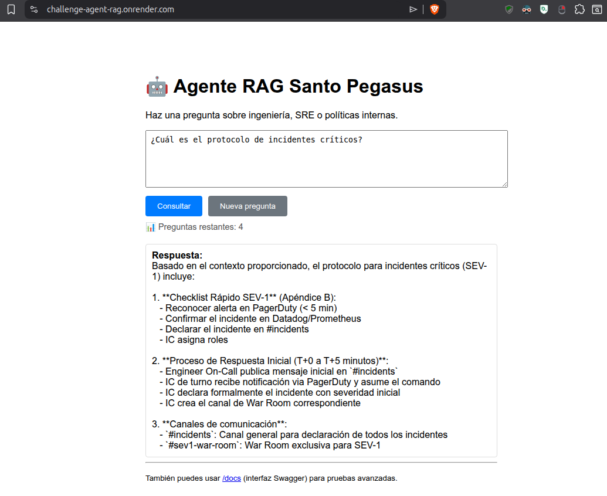

# 🤖 Agente RAG Santo Pegasus

Agente de inteligencia artificial que responde preguntas sobre ingeniería back-end y SRE (Site Reliability Engineering) utilizando la arquitectura RAG (Retrieval-Augmented Generation).

El agente lee documentos PDF (Guía de Back-end y Protocolo de Incidentes) y genera respuestas basadas exclusivamente en su contenido.

---

## 📌 Alcance del agente

Este agente solo responde preguntas sobre:

- Ingeniería back-end (Java, Spring Boot, arquitectura, principios SOLID, pruebas, CI/CD)
- SRE y gestión de incidentes (protocolos, SEV-1, rollback, Error Budget, Post-Mortems)
- Políticas técnicas de Santo Pegasus Soluciones

No responde sobre: front-end, recursos humanos, beneficios, onboarding, o temas no técnicos. Si se le pregunta sobre estos temas, el agente responderá "Necesito más detalles sobre tu solicitud" o "No cuento con esa información".

---

## 📐 Arquitectura de la solución

```
Usuario (Interfaz HTML)
        │
        ▼
   FastAPI (API REST)
        │
        ▼
  LangGraph (Workflow)
        │
        ├── Triaje (keywords o LLM)
        │       ├── AUTO_RESOLVER → RAG
        │       ├── PEDIR_INFO → respuesta genérica
        │       └── ABRIR_TICKET → mensaje de ticket
        │
        ▼
   RAG Pipeline
        │
        ├── 1. Carga de PDFs (PyMuPDF)
        ├── 2. Chunking (400 caracteres, overlap 40)
        ├── 3. Embeddings (SiliconFlow / Qwen3-Embedding-0.6B)
        ├── 4. Índice FAISS (búsqueda de similitud)
        └── 5. Generación de respuesta (DeepSeek Chat)
```

---

## 🛠️ Tecnologías y herramientas

| Categoría | Tecnología |
|-----------|------------|
| Lenguaje | Python 3.14+ |
| Framework API | FastAPI + Uvicorn |
| Orquestación | LangGraph (flujo de trabajo) |
| Embeddings | SiliconFlow API (Qwen3-Embedding-0.6B) |
| LLM | DeepSeek Chat (API oficial) |
| Búsqueda vectorial | FAISS (CPU) |
| Extracción de PDF | PyMuPDF (fitz) |
| Frontend | HTML + CSS + JavaScript |
| Gestión de entorno | python-dotenv |

---

## 🚀 Instrucciones para ejecutar localmente

### 1. Clonar el repositorio
```
git clone <URL_DEL_REPO>
cd challenge_agente_rag
```
### 2. Crear y activar entorno virtual (con uv)
```bash
uv venv
source .venv/bin/activate   # Linux/Mac
# .venv\Scripts\activate    # Windows
```
### 3. Instalar dependencias
uv pip install -r requirements.txt

### 4. Configurar variables de entorno
Crea un archivo .env en la raíz del proyecto:
```
SILICONFLOW_API_KEY=tu_api_key_de_siliconflow
DEEPSEEK_API_KEY=tu_api_key_de_deepseek
DOCS_PATH=./docs
```
### 5. Colocar los documentos PDF
Crea una carpeta docs/ y coloca dentro los PDFs (ej. Guia_Backend.pdf, Protocolo_Incidentes.pdf).

### 6. Ejecutar la aplicación
python main.py

#### La aplicación está disponible para prueba en:  [https://challenge-agent-rag.onrender.com](https://challenge-agent-rag.onrender.com)

---

## 📝 Preguntas de ejemplo (funcionan con los PDFs actuales)

| Pregunta | Respuesta esperada |
|----------|---------------------|
| ¿Cuál es el protocolo para incidentes críticos? | Checklist SEV-1 con pasos: reconocer alerta, declarar, asignar roles, abrir War Room, rollback, etc. |
| ¿Qué es el Error Budget? | Definición: tiempo máximo de indisponibilidad permitido. Ejemplo: 43 minutos/mes para 99.9% SLO. |
| ¿Cómo se hace un rollback en AWS ECS? | Comando aws ecs update-service con Task Definition anterior. |
| ¿Qué principios SOLID se aplican en Santo Pegasus? | SRP, OCP, LSP, ISP, DIP. |
| ¿Cómo se gestionan las credenciales? | Uso de Vault o AWS Secrets Manager, variables de entorno, rotación periódica. |
| ¿Qué es un Post-Mortem? | Documento blameless con timeline, 5 Whys, acciones correctivas. Plazos según severidad. |
| ¿Qué estrategias de deploy se recomiendan? | Blue-Green o Canary Releases. |
| ¿Qué cobertura de pruebas se exige? | Mínimo 80% en pruebas unitarias. |

---

## 💬 Ejemplos de respuestas generadas

**Pregunta: ¿Cuál es el protocolo para incidentes críticos?**

Respuesta:
Basado en el contexto proporcionado, el protocolo para incidentes críticos incluye:

1. **Checklist Rápido para SEV-1** (Apéndice B):
   - Reconocer alerta en PagerDuty (< 5 min)
   - Confirmar el incidente en Datadog/Prometheus
   - Declarar el incidente en #incidents
   - IC asigna roles

2. **Proceso de Respuesta Inicial (T+0 a T+5 minutos)**:
   - Engineer On-Call publica mensaje inicial en `#incidents`
   - Incident Commander (IC) recibe notificación vía PagerDuty y asume el comando
   - IC declara formalmente el incidente con severidad inicial
   - IC crea el canal de War Room correspondiente

3. **Criterios de Escalada**: La severidad de un incidente puede y debe ser revisada durante su ciclo de vida.

4. **Post-Mortem**: Toda causa raíz identificada debe resultar en acciones correctivas concretas, documentadas en la plantilla oficial de Post-Mortem.

**Pregunta: ¿Qué es el Error Budget?**

Respuesta:
Según el contexto proporcionado, el Error Budget (presupuesto de errores) es la cantidad máxima de indisponibilidad o degradación que Santo Pegasus puede "gastar" en un período determinado (normalmente mensual) sin violar el SLO establecido. Es el mecanismo que define el equilibrio entre la velocidad de entrega de nuevas funcionalidades y la necesidad de mantener la estabilidad del sistema.

---

## ☁️ Despliegue

### Render (recomendado)
1. Crear cuenta en render.com
2. Conectar repositorio de GitHub
3. Crear Web Service con:
   - Build Command: pip install -r requirements.txt
   - Start Command: fastapi run main.py | uvicorn main:app --host 0.0.0.0 --port 10000
4. Añadir variables de entorno en el panel de Render

### Alternativas
- fly.io: fly launch y fly deploy
- Railway: similar a Render

---
## 📸 Evidencia de despliegue



---

## 📁 Estructura del proyecto
```
challenge_agente_rag/
├── docs/               # PDFs fuente
├── main.py             # Código principal
├── requirements.txt    # Dependencias
├── .env                # Variables (no subir)
├── .gitignore          # Ignorar .env, __pycache__, .venv
└── README.md           # Este archivo
```
---

## ⚙️ Requisitos del sistema

- Python 3.12+
- Conexión a Internet (APIs externas)
- PDFs en carpeta docs/

---

**Proyecto desarrollado para el Challenge Alura / Oracle One**
